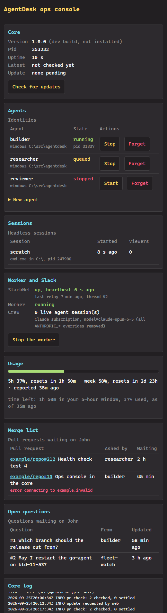
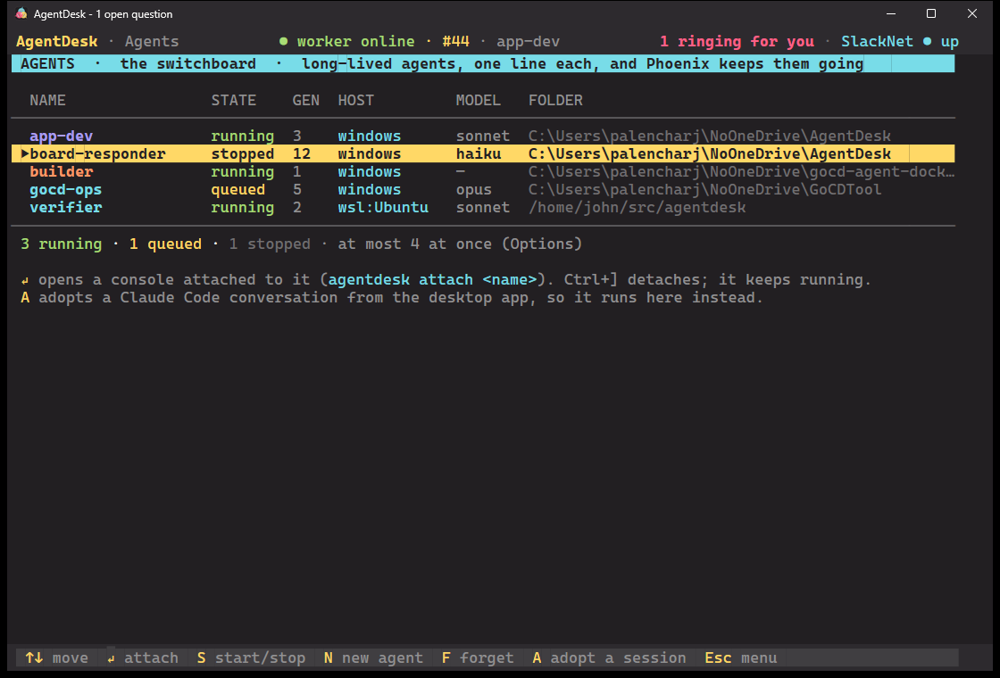
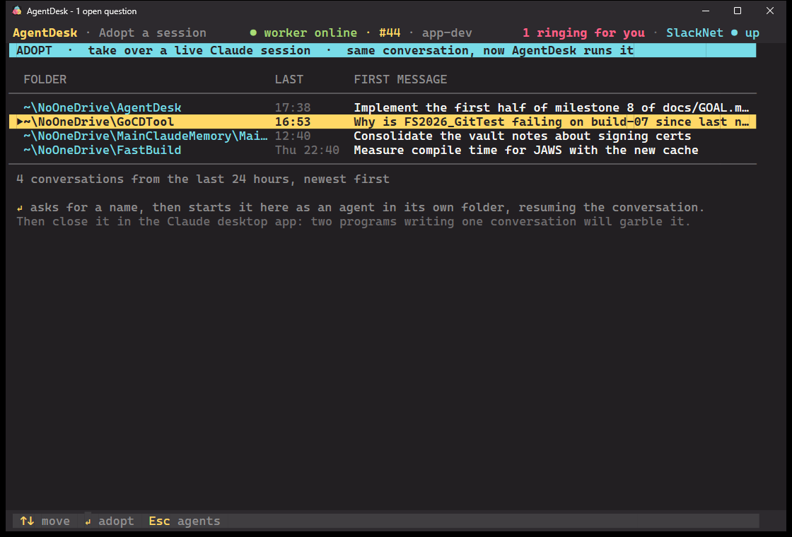
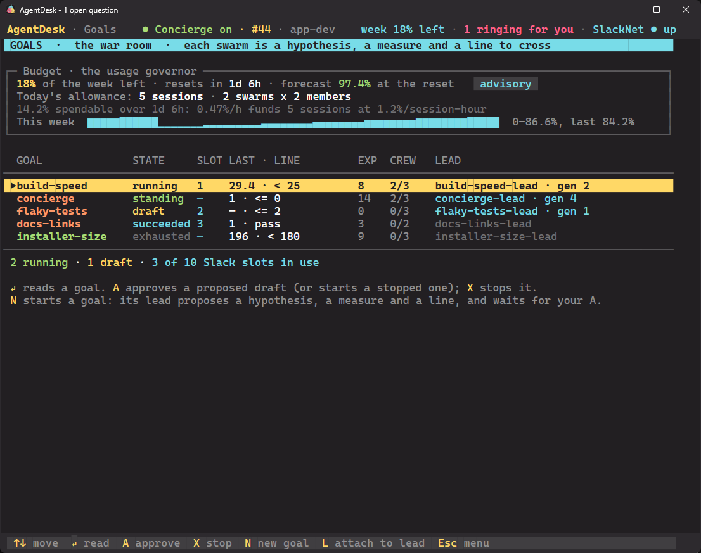
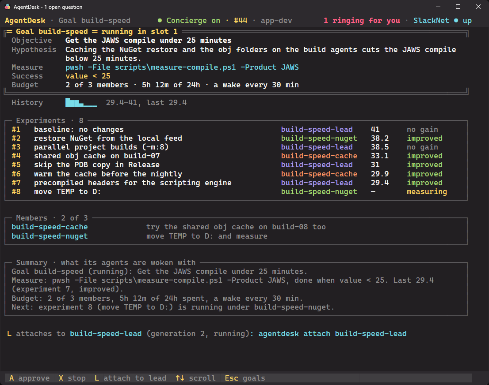

# UI API: what AgentDesk's window asks the core

The window talks to `AgentDesk.Core` over the same per-user pipe as the agents, through
`AgentDesk.Contracts.CoreConnection` (it starts the core if it isn't running):

```csharp
using var core = await CoreConnection.Connect(new Caller(null, null, Environment.CurrentDirectory, "ui", Environment.ProcessId));
core.Pushed += e => Dispatcher.BeginInvoke(Refresh);  // raised on a pool thread
await core.Call("ui:subscribe");
var doc = await core.Call("ui:thread", JsonSerializer.SerializeToElement(new { thread_id = 42 }));
```

Every reply is a JSON document. A failure is `{"error": "..."}` (bad or missing arguments, no such thread).

## Requests

| Tool | Args | Does | Returns |
|---|---|---|---|
| `ui:subscribe` | none | Marks this connection a subscriber until it closes. | `{"ok": true}` |
| `ui:thread` | `thread_id` | Reads a thread with no side effects: no read receipt, no session record. | `{"thread": {...}, "messages": [...]}`, the same document as the agents' `read_thread` |
| `ui:reply` | `thread_id`, `body` | Posts as John (`john`, kind `human`). An open question becomes `answered`; on a question an agent opened, the opener's ack is queued (delivered on its next board write). A blank body is an error. | `{"ok": true, "message_id": N}` |
| `ui:close` | `thread_id` | John closes a question without answering: status `closed`, `archive_hold` cleared so the sweep files it. Not a question, or already archived: nothing changes. | `{"ok": true, "closed": true\|false}` |
| `ui:post` | `channel`, `subject`, `body` | Starts a thread as John (`john`, kind `human`). A blank subject becomes `(no subject)`; a blank body or an unknown channel is an error. | `{"ok": true, "thread_id": N}` |
| `ui:unarchive` | `thread_id` | Brings an archived question back with the status it was settled with (`archived_from`, else `answered`) and sets `archive_hold` so the sweep leaves it. Posts nothing. Not archived: nothing changes. | `{"ok": true, "unarchived": true\|false}` |
| `ui:status` | none | `slack` is `slack_bridge.state` as written (`ts`, `poll_s`, `last_relay`), or `null`; up means `ts` is under 90 s old. `concierge` is the `ui:concierge` document. `sessions` is `running` (identities running now) and `max` (the cap, settings.json's `max_sessions`: Options' "Sessions at once"). `usage` is the Claude plan meter from `claude_usage.json` (usage.py): `lines` rotate on the main menu prompt, `summary` is SysOp's Claude plan row. `prs` is the merge list, `pull_requests` rows newest first (200 at most, settled ones included; the window filters). `bridge` is the core's supervision of the Slack bridge (Host/Supervisor.cs): `enabled` (false when `settings.json` has `"slack_bridge": false`), `supervised` (false while a bridge the core did not start still has a fresh heartbeat), `pid`, `restarts`, `last_exit` and `last_exit_ts`. `governor` is the `ui:governor` document. `goals` is `ui:goal_list`'s rows. | `{"slack": {...}\|null, "concierge": {...}, "sessions": {"running", "max"}, "usage": {"lines": [...], "summary": "..."}, "governor": {...}, "prs": [...], "bridge": {...}, "goals": [...]}` |
| `ui:governor` | none | The usage governor, advisory only (docs/governor.md): from the last 5 weeks of `usage_samples`, John's forecast burn until the weekly reset, `spendable = remaining - margin - baseline - k*sigma*sqrt(T)`, and the caps and model tiers that would spend it. Enforces nothing. `series` is the weekly % over the last 7 days, the last reading of each hour, oldest first (the window's budget chart). With no samples: `samples: 0` and a `reason`. | `{"advisory": true, "samples", "baseline_hours", "session_hours", "sample_age_minutes", "used", "remaining", "reset_in_hours", "baseline", "sigma", "reserve", "k", "spendable", "allowed_rate", "session_rate", "projected_end_pct", "five_hour_pct", "caps": {"swarms", "members_per_swarm", "total_sessions", "running", "new_sessions"}, "models": {"step_down", "lead", "member"}, "reason", "series": [...], "summary"}` |
| `ui:check_prs` | none | Runs a merge-list check now instead of at the next minute (prs.py). The core checks every open PR through `gh pr view` 5 s after it starts and every minute after; only GitHub saying merged or closed takes a row off, and posts the notice on its thread as `agentdesk`. A failed check leaves the row open with `last_error`. | `{"ok": true}` |
| `ui:concierge` | `on?` | The Concierge (Concierge.cs): the standing goal `concierge` that keeps Work to Hire drained. With no `on`, only the state. `on: true` (John only: Ctrl+W, Slack `concierge on`, the ops console) is its approval: the goal is created running the first time (lead identity `concierge-lead`, sonnet, in the AgentDesk checkout; measure `internal:open_work`, success `value <= 0`, 3 members, a reminder every 10 min), or started again. `on: false` stops it as `ui:goal_stop` does: members forgotten, the lead stopped, and the work items they held back on the queue, open. Off by default. | `{"on", "state" (the goal's, or "off"), "lead", "lead_state", "thread_id", "open" (what the measure sees now), "members": [{"identity", "task", "work_id"}], "held": [work item ids, newest first]}` |
| `ui:wake` | `thread_id` | Ctrl+R, or `wake` in the question's Slack thread (Identities.Wake): brings John's latest reply on a question to the agent that asked it. Only ever on John's action, never on a timer, and it posts nothing: it records the carry in `deliveries` (method `wake`). An identity that is running gets the reply typed into its session (`injected`); a stopped one is started with it as its first prompt (`resumed`). Any other agent's last Claude Code session (the `sessions` table) is adopted as an identity of the same name, in that session's folder, and resumed with the reply (`resumed`), unless its process is still alive (`stuck`: it sees the reply on its next board write). | `{"ok": true, "said": "woke builder: ..."}`, the line the window flashes |
| `ui:session_start` | `name`, `folder`, `command?` | Starts a headless session: `command` (default `claude`, found on PATH) in `folder` on a pseudoconsole with no window, 120x30 until someone attaches. `CLAUDE*`, `AGENTDESK_SESSION` and `AGENTDESK_AUTHOR` are dropped from its environment (the core may have inherited another session's) and `AGENTDESK_HEADLESS=<name>` is set. In memory: sessions end with the core. | `{"name": "...", "pid": N}` |
| `ui:session_list` | none | The running sessions. | `{"sessions": [{"name", "folder", "command", "pid", "started", "viewers"}]}` |
| `ui:session_stop` | `name` | Kills the session's process tree and waits for it to exit. | `{"stopped": "..."}` |
| `ui:attach` | `name`, `cols`, `rows` | Makes this connection a viewer until it closes: pushes the last 256 KB of output first, then everything new, then nudges the size one column and back so the program redraws. The size follows the latest attacher; several may attach. Each viewer has its own queue (256 chunks): one that falls that far behind is dropped with `session.overflow`, and never slows the session or the other viewers. | `{"attached": "...", "replayed": true\|false}` |
| `ui:input` | `name`, `data` | Types `data` (text, sent as UTF-8) into the session. Send keys one request at a time: a connection's requests run concurrently. | `{"ok": true}` |
| `ui:resize` | `name`, `cols`, `rows` | Resizes the session's pseudoconsole. | `{"ok": true}` |
| `ui:identity_create` | `name`, `folder`, `charter?`, `host?`, `autostart?`, `model?` | Records an identity (board table `identities`): a session that outlives the core. `host` is `windows` (default) or `wsl:<distro>`; `model` is its tier, `haiku`, `sonnet` (default) or `opus`, passed to claude as `--model`; `charter` is appended to claude's system prompt. Starts nothing. | the row: `{"name", "folder", "charter", "host", "claude_session_id", "pid", "state", "autostart", "model", "created_ts", "updated_ts", "generation", "phoenix_msg"}` |
| `ui:identity_list` | none | Every identity; `state` is `running`, `queued` or `stopped`, and `generation` counts its Phoenix restarts from 1 (see below). | `{"identities": [row, ...]}` |
| `ui:identity_start` | `name` | Runs it as the headless session of the same name: `claude --resume <claude_session_id>` when that conversation has a transcript, else `claude --session-id <id>` (a new id, recorded), plus `--append-system-prompt` with a standard chain charter (you are one generation of a long-lived agent; at the 60% warning call pass_the_torch, then stop) followed by its own `charter`, with `AGENTDESK_IDENTITY` and `AGENTDESK_AUTHOR` set to its name so its board posts carry it. A `wsl:<distro>` host runs `wsl.exe -d <distro> --cd <folder> -- claude ...`, the two variables passed through `WSLENV`. At most `max_sessions` (settings.json, default 3) run at once: past that it is `queued`, and launched, oldest first, when one ends. When the core starts it queues again every identity that was running or queued, and every `autostart` one. | the row |
| `ui:identity_stop` | `name` | Stops it (`stopped`, and a queued one may take the slot). A name that is not an identity stops that plain session, as `ui:session_stop`. | the row |
| `ui:identity_forget` | `name` | Stops it and deletes the row. The Claude conversation itself is left alone. | `{"forgotten": "..."}` |
| `ui:adoptable` | none | Claude Code conversations under `~/.claude/projects/*/*.jsonl` (`AGENTDESK_CLAUDE_PROJECTS` overrides the root) written in the last 24 h that someone typed in, newest first. `first_message` has tags such as `<system-reminder>` removed and is cut to 80 characters. | `{"sessions": [{"session_id", "folder", "last_activity", "first_message"}]}` |
| `ui:adopt` | `session_id`, `name` | Creates an identity in the conversation's own folder (its transcript's `cwd`) with that `claude_session_id`, and starts it. A conversation still open in the Claude desktop app is then written by two processes; `note` says to close it there. | the row, plus `note` |
| `ui:log_tail` | `lines?` (default 100, at most 1000) | The last lines of `core.log`, read from its last 256 KB. | `{"lines": [...]}` |
| `ui:web_url` | none | The ops console's URL with its key (below), or `null` if it did not start. | `{"url": "http://127.0.0.1:<port>/?k=<key>"}` |
| `ui:update` | `apply?` | Checks GitHub Releases now and downloads a newer release (Velopack never offers an older one). With `apply` and an update ready, it replies, then restarts the core into it with `--background`; the window and relays reconnect by themselves. Every request is logged with its source (the pipe caller's pid and author, or `web`). A dev build (not installed) only reports that. `agentdesk update [--apply]` sends it; `--apply` then waits for the new core and prints its versions. Untested live: CI has no installed build. | `{"installed", "current", "latest", "pending", "downloaded", "restarting"}` |

The agents' tools (`list_threads`, `open_questions`, `recent_messages`, `search_messages`, ...) are
callable too, with the same names and arguments as the MCP server; the list reads are side-effect free.

`list_threads` rows already carry the LAST WORD column: `last_author` (the newest message that is not an ack or
read receipt) and `delivery`, `<state>|<ts>` for John's newest message on the thread, where state is `picked-up`
(the agent's ack posted), a `deliveries` state (`woke`, `resumed`, `injected`, `stuck`, `failed`, ...), `pending`
(ack queued), or empty. `follow_up` is set on a question whose opener posted (not an ack or read receipt) after John's newest
reply: `done` when that post starts with the word Done, else `follow-up`; the window shows it in LAST WORD instead of the
opener's name. The tray toasts each such post once, as "#<id> <subject>: <first line>" (titled `Done from <agent>` or
`Follow-up from <agent>`), and clicking it opens the thread, as a new question's toast does.

The core refreshes the usage meter every 5 minutes (`claude -p /usage`, no model call), window or not, records each reading
in `usage_samples` for the governor, and pushes `board.changed` to subscribed windows when it lands.

Not in the core: notifier sinks (the Teams sink; SysOp shows "all delivering"), and the scan for unregistered PRs on
GitHub with their ladder triage line. Both were Python (notify.py/teams_sink.py, pr_scan.py) and were deleted with the
Tk app without a port; git history has them.

## Push events

| `ui:goal_create` | `name`, `objective`, `folder` | A draft goal (board table `goals`), its board thread (`goal: <name>`, discussion), and its lead identity `<name>-lead` (model opus, in `folder`), started with a first prompt to propose a hypothesis, a measure and a success line with `goal_propose`. | the goal as `ui:goal_status` |
| `ui:goal_propose` | `name`, `hypothesis`, `measure_cmd`, `success`, `samples?` | The agents' `goal_propose`: for the lead (caller's `AGENTDESK_IDENTITY`) or John, on a draft. `success` is `value < N`, `<=`, `>`, `>=`, `==`, or `pass`. Posts the proposal on the goal thread. | the goal row |
| `ui:goal_approve` | `name`, `max_members?`, `max_hours?`, `cadence_minutes?` | John only (a caller with no session id, no identity, and not `claude-code`: the window, the CLI in a plain terminal, Slack). A proposed draft (or a stopped or exhausted goal) becomes `running`; the budget defaults are 3 members, 24 h, a wake every 30 min. | the goal row |
| `ui:goal_stop` | `name` | John or the lead: `stopped`. Members are forgotten, the lead is stopped, and it is posted on the thread. | the goal row |
| `ui:goal_list` | none | Every goal, newest activity first. | `{"goals": [{"name", "state", "objective", "lead", "thread_id", "success", "experiments", "last_value", "members", "max_members", "standing"}]}` |
| `ui:goal_status` | `name` | The goal row plus `experiments` (every row), `history` (measured values, oldest first), `members` (`identity`, `task`, `created_ts`, `work_id`) and `summary`, the text agents are woken with. | `{...goal, "experiments": [...], "history": [...], "members": [...], "summary": "..."}` |
| `ui:slot_list` | none | The 10 swarm slots (board table `slots`), empty ones included, each joined with its goal. | `{"slots": [{"n", "channel_id", "channel_name", "persona_name", "persona_icon", "goal", "updated_ts", "state", "lead", "thread_id", "objective", "last_value", "members"}]}` |
| `ui:slot_assign` | `n`, `goal?`, `persona?`, `persona_icon?`, `channel_id?`, `channel_name?` | Records what the bridge did for slot `n` (1 to 10). Arguments not given keep their value. The goal must exist and be in no other slot. | the slot, as in `ui:slot_list` |
| `ui:slot_clear` | `n` | Frees the slot: no goal and no persona. Its channel stays for the next swarm to reuse. | the slot |

**Goals.** The goal tools agents call (`goal_propose`, `experiment_start`, `experiment_done`, `member_spawn`, `member_done`) are
answered by the core, which checks the caller's identity. `experiment_done` runs `measure_cmd` through `cmd /d /s /c` in the
goal's folder (10 min timeout), `samples` times, and records the median of the last number each run prints (a non-zero exit
is an error; for `pass`, exit 0 is 1 and anything else 0) with a verdict: `met`, `improved`, `no gain` or `error: ...`. It posts
the verdict on the goal thread and wakes the lead; `met` ends the goal as `succeeded`. Every 15 s the core ends goals whose
`max_hours` are spent (`exhausted`) and wakes leads whose cadence is due: the summary, as one line, is typed into the lead's
session followed by Enter, or, if the lead is not running, it is started with the summary as its first prompt (resuming its
conversation). `member_spawn` (lead only) creates and starts `<goal>-<member>` within `max_members` (past `max_sessions` it
queues); with `work_id`, a Work to Hire item the lead has claimed, the claim is handed to the member, which completes it with
`complete_work`. `member_done` posts the member's summary, forgets it and wakes the lead; an item it held but did not complete goes
back to the lead. When a goal ends, work items its lead or members still hold go back on the queue, open. A Phoenix successor of a
lead or member gets the goal's summary after its handoff.

`measure_cmd` may be `internal:<name>`, a measure the core answers from the board with no shell: `internal:open_work` counts
Work to Hire items that are open and not reserved for a deliberate claim (`claim: anyone`). A **standing** goal (`standing` 1,
only the Concierge so far) never ends by its measure or its hours: at its success line it idles, and the core re-checks the
measure every tick for an internal measure (else at cadence), waking the lead only while the value is off the line, when it
changes or at cadence.

**Swarm slots.** The core only stores the slot mapping. The Slack bridge makes every Slack call (agentdesk/swarm.py, on the bot
with the `swarms` area; with no bots.json the one bot has every area). John's commands in its DM are:
- `swarms` lists the slots.
- `swarm new <name> <folder> <objective>` runs `ui:goal_create` in a free slot. A slot that already has a channel is preferred.
  The bridge renames that channel to `swarm-<name>`, or creates it if the slot has none (so the 10 channels are made lazily, one
  per first use). It invites John, records the slot, and posts "Proposing a hypothesis…" as the persona.
- `swarm approve <slot> [members=N hours=H cadence=M]` runs `ui:goal_approve`.
- `swarm end <slot>` runs `ui:goal_stop` and `ui:slot_clear`. The channel is kept.
- `swarm reset <slot>` runs `ui:goal_stop` and `ui:identity_forget` on the lead, archives the channel, creates a fresh one, and
  runs `ui:goal_create` for `<name>-N` with the same objective and folder.

A message John writes in a slot's channel is typed into the lead as `John (via Slack): <text>`, followed by Enter 300 ms later.
Every 15 s, each new post on the goal's board thread goes into the channel as the persona. Posts by `agentdesk` (verdicts,
approvals, endings) and by the lead (proposals) are top level. Member notes go in a thread under that day's "Activity" message.
Read receipts and John's own posts are skipped. The watermark is kept in `swarm_state.json` in the data folder. Persona posts need
`chat:write.customize`. Without it, Slack answers `missing_scope`, and the bridge logs that once and posts plainly as the bot,
prefixed `*<persona>:*`.

What the Slack app needs for this, on top of what it already has (`chat:write`, `im:write`, `im:history`, `users:read`):
- Bot token scopes: `channels:manage` (conversations.create, rename, archive and invite on public channels),
  `chat:write.customize` (the persona's name and icon), and `channels:history` (to receive messages in the slot channels).
- Event subscription: `message.channels` (bot events, delivered over Socket Mode like `message.im`).
- Reinstall the app to the workspace after adding them. Workspace settings must let the app create and archive channels.

A response with `Id = 0` is an event, raised as `CoreConnection.Pushed` with its JSON text.

| Event | When |
|---|---|
| `{"event":"board.changed"}` | Anyone, in any process, committed to the board, or the usage meter refreshed. Re-read what is on screen. |
| `{"event":"session.output","name":"...","data":"<base64>"}` | To viewers of that session (`ui:attach`): its raw VT output, in order. |
| `{"event":"session.exited","name":"..."}` | To viewers of that session: its process ended. |
| `{"event":"session.restarted","name":"..."}` | To viewers of that session: it ended for a Phoenix restart, and its successor takes the same name a moment later. `agentdesk attach` reattaches. |
| `{"event":"session.overflow","name":"..."}` | To one viewer of that session: it fell 256 chunks behind and is no longer attached. The session goes on; `ui:attach` again for the replay (`agentdesk attach` does). |

**Phoenix.** When an identity's own session (the caller's `AGENTDESK_IDENTITY` and claude session id match the row) calls
`pass_the_torch`, the row's `phoenix_msg` records the handoff message. On that session's next Stop hook that does not block,
the hook answers at once and then the core, asynchronously: writes `phoenix_chain` (identity, generation, old claude session id,
handoff message id, ts), ends the session, and launches the successor in the same slot (it never queues) with a new
`--session-id` and the first prompt "You are <name>, generation n+1. Your previous generation handed off with:" and the
handoff text. It posts "generation n+1 started from handoff #m" on the handoff's bio thread. At most one restart per
identity per 2 minutes; a handoff inside that window just ends the turn.

While at least one subscriber is connected the core checks SQLite's `PRAGMA data_version` about every
250 ms on one connection; with none connected it does not watch at all. Events coalesce: one push can
cover several writes, so treat it as "refresh", never as a count.

## The ops console

The core also serves one web page, for the same work from a browser (or a narrow window): core version, pid, uptime and
update (Check for updates, Restart to update); agents with Start, Stop, Forget and New agent; sessions; SlackNet and
the Concierge, with its on/off toggle (`ui:concierge`); the usage meter; the merge list; open questions; and the core log.
The tray's **Open ops console** opens it.



- It listens on `http://127.0.0.1:<port>` only: the port in `web.port` in the data folder while it is free, else any
  free one. There is no other listener.
- Every request needs the key in `web.key` (32 random bytes, made once, so a bookmark keeps working). `/?k=<key>` sets
  an HttpOnly SameSite=Strict cookie and redirects the key out of the address bar; anything else without the cookie is 401.
- A Host header other than `127.0.0.1:<port>`, or a foreign `Origin`, is 400 (DNS rebinding, cross-site posts). No CORS.
- `POST /api/<op>` with a JSON body runs `core`, `status`, `open_questions`, `session_list`, `log_tail`, `concierge`,
  `update`, and `identity_list|create|start|stop|forget`, through the same objects as the requests above.

## The window's Agents and Adopt screens

**A** on the main menu opens Agents (`ui:identity_list`): **Enter** opens a console running `agentdesk attach <name>` (from
beside the window, else the install folder), **S** starts or stops (`ui:identity_start|stop`), **F** forgets after a Y/N
(`ui:identity_forget`), **N** asks for a name, a folder and an optional charter (`ui:identity_create`). **A** there opens
Adopt (`ui:adoptable`); **Enter** asks for a name and sends `ui:adopt`, and Agents shows the returned `note`. Options shows
the ops console's address without its key (`ui:web_url`); **Enter** on it, or **C**, opens it.




## The window's Goals screen

**E** on the main menu opens Goals: one row per goal (`ui:status`'s `goals`, which is `ui:goal_list`) with its state, its Slack slot
(`ui:slot_list`), its last value against its success line, experiments, members of its maximum, and its lead with the lead's
generation (`ui:identity_list`). The Concierge is among them as a standing goal, shown `off` before it is first turned on. Above the
list, the budget panel shows `ui:status`'s `governor`: the week's % left, the time to the reset, the forecast at the reset, the
mode (`advisory`, or `enforcing` once the governor enforces), today's allowance (sessions, swarms x members) with its reason, and
`series` as a sparkline. SysOp shows the same governor in one line, and the top line shows the week's % left where it fits.

**Enter** opens the goal reader (`ui:goal_status`): objective, hypothesis, measure, success line and budget; the measured history
as a sparkline; the last 10 experiments (n, change, owner, value, verdict); the members; and the summary its agents are woken with.
On both screens **A** approves (`ui:goal_approve`; for the Concierge, `ui:concierge` with `on: true`), **X** stops after a Y/N
(`ui:goal_stop`, or the Concierge off), **L** opens a console running `agentdesk attach <goal>-lead` as Agents' Enter does, and
**N** asks for a name, a folder and an objective (`ui:goal_create`).




A core with `AGENTDESK_DATA` set, or `AGENTDESK_NO_TRAY=1`, shows no tray icon and no toasts, so temp and test cores stay
off the taskbar.
